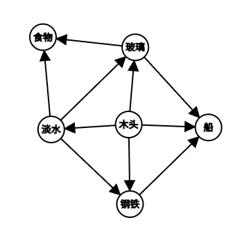

## 故事

你被派遣去海边发展航海事业，并探测周围海域的水声

## 操作

#### 造船相关
1. 伐木：获取木头
2. 冶铁：获取钢铁
3. 生产玻璃：获取玻璃
4. 造船：消耗木头、钢铁、玻璃，获得一艘船

#### 食物相关
1. 捕鱼：前期获取食物的途径

#### 淡水相关
1. 获取淡水：前期获取淡水的途径

#### 航海相关
1. 航海：根据船的数量携带食物和淡水进行一次航海冒险

## 建筑

1. 伐木场：消耗食物、木头和钢铁获得一座伐木场，每10秒获得木头
2. 水厂：消耗食物、木头和钢铁获得一座水厂，每10秒消耗木头获得淡水
3. 冶炼厂：消耗食物、木头和钢铁获得一座冶铁厂，每10秒消耗淡水、木头并获得钢铁
4. 玻璃厂：消耗食物、木头和钢铁获得一座玻璃厂，每10秒消耗淡水、木头并获得玻璃
5. 食品加工厂：消耗食物、木头、玻璃和钢铁获得一座食品加工厂，每10秒消耗淡水、玻璃获得食物
6. 造船厂：消耗食物、木头和钢铁获得一座造船厂，增加每次造船操作消耗资源的量和生产出船的量

## 航海冒险

进入航海地图，你操控舰队在海上探索岛屿或者探测水声，最后要在食物和淡水耗尽前回到陆地，带回资源和水声资料
